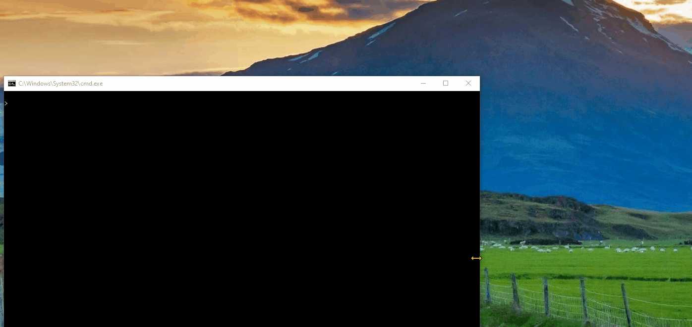
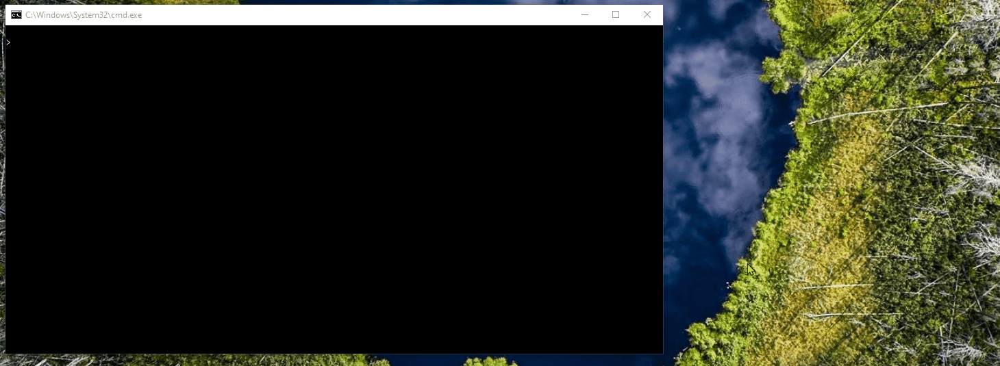
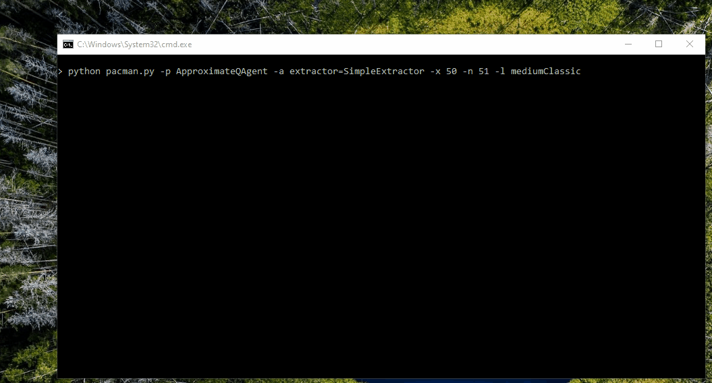

# Reinforcement Learning
In this project, I implement value iteration, Q-learning and approximate Q-learning, and apply them to the Gridworld, Bridge grid, Crawler and Pacman.

# The Code in Action

In this section, we could see the final results of the implementations.

## Value Iteration

The following shows the policy computation and its execution for 10 times for the Gridworld. `values` are numbers in squares, `Q-values` are numbers in square quarters, and `policies` are arrows out from each square.

## Bridge Crossing

The following is a grid world map with the low- and high-reward terminal states separated by a narrow "bridge", on either side of which is a chasm of high negative reward. The agent starts near the low-reward state and goes on to the high reward-state.

## Q-Learning
The following is the implementation of Q-Learning for the agent to learn what to do in the environment:

## Crawler

The following shows the crawler robot that uses Q-Learning to learn:

## Q-Learning and Pacman

The following is the implementation of the Pacman that uses Q-Learning to play the game:

## Approximate Q-Learning

The following is the implementation of the Pacman that uses approximate Q-Learning to win the game:

